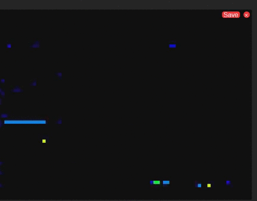
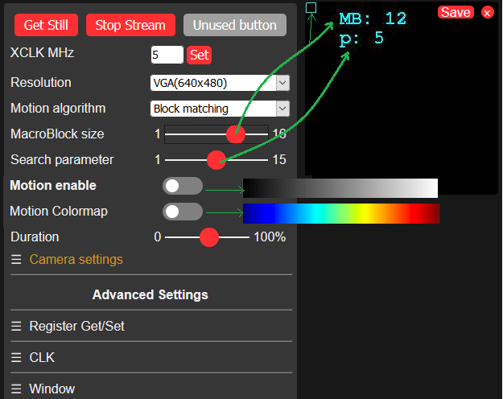

# Camera webserver with motion

Camera webserver esp32 with motion library. 

| algo  | demo  | input size | time |
|---|---|---|---|
|  **lucas kanade** |     | 160 x 120 |  600ms (+130ms display time)
| **block matching ARPS** |   | 640 x 480 | 130ms (no motion) to 380ms (motion)  (**+2sec display**) with 8x8 MB search 9|
| **block matching EPZS** |  | 640 x 480 |  150ms to 380ms (**+2sec display**) with 6x6 MB search 9|

Note : Block matching takes longer to display (2sec per frame) because of upscaling to input image size for a nicer display. That's why we see so much latency.

## Usage block matching

## Preparation

To run this example, you need the following components:

* An ESP32 Module: Either **ESP32-WROVER-KIT** or **ESP-EYE**.
* A Camera Module: Either **OV2640** or **OV3660** or **OV5640**.

## Quick Start

After you've completed the hardware settings, please follow the steps below:

1. **Connect** the camera to ESP32 module. For connection pins, please see [here](https://github.com/espressif/esp-who/blob/master/docs/en/Camera_connections.md)
2. **Configure** the example through `idf.py menuconfig`;
3. **Build And Flash** the application to ESP32;
4. **Open Your Browser** and point it to `http://[ip-of-esp32]/`;
5. **To Get Image** press `Get Still` or `Start Stream`;
6. **Use The Options** to enable/disable Motion detection, Dithering and more;
t. **View The Stream**  in a player like VLC: Open Network `http://[ip-of-esp32]:81/stream`;

For more details of the http handler, please refer to [esp32-camera](https://github.com/espressif/esp32-camera).

## References

This code is revisited from [https://github.com/espressif/esp-who](https://github.com/espressif/esp-who) .

## License
[MIT](https://choosealicense.com/licenses/mit/)
