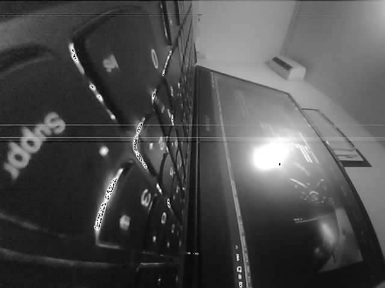
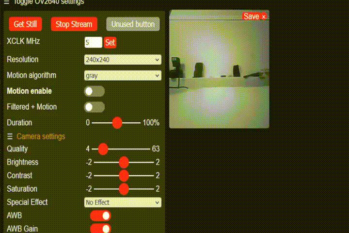

# Camera webserver with motion

## Changes
- esp32motion : enhanced EPZS algorithm accuracy at the cost of computation load.
- added JPEG decoder :
  - Now it won't load the library from the internal ROM/jpgd.h but instead a custom `jpgd.h` library in development.
  - `jpgd.h` can handle new features, at the moment : 
    -   `jpg2gray` : convert directly during decoding to monochrome
    -   `jpg2gray_filtered` : during conversion apply a median filter to remove horizontal line artifacts. (cf .gif below)
    -   developped a DCT-phase filter which can be usefull for motion detection
    -   developped a DCT based denoiser
  -   Removed upscaling (too slow)
  -   GUI added a test "Motion Algorithm" which is just the capture converted to gray. It show the decoder latency and the effect of artifacts filtering.   

### Phase/Magnitude DCT
|gray| Phase |Magnitude |
|---|---|---|
||||

### `jpg2gray_filtered`

### Note 
 - DCT denoiser can be enable/disable in `tjpgdcnf.h` under `DCT_FILTER`
 - DCT phase and modulation can be enable/disable in `tjpgdcnf.h` under `PHASE_DCT`
## Old Results

| algo  | demo  | input size | time |
|---|---|---|---|
|  **lucas kanade** |     | 160 x 120 |  600ms (+130ms display time)
| **block matching ARPS** |   | 640 x 480 | 130ms (no motion) to 380ms (motion)  (**+2sec display**) with 8x8 MB search 9|
| **block matching EPZS** |  | 640 x 480 |  150ms to 380ms (**+2sec display**) with 6x6 MB search 9|

Note : Block matching takes longer to display (2sec per frame) because of upscaling to input image size for a nicer display. That's why we see so much latency.

## Usage block matching

## Preparation

To run this example, you need the following components:

* An ESP32 Module: Either **ESP32-CAM**.
* A Camera Module: Either **OV2640**.

## Quickstart with PlatformIO + VScode

 - Press F1 (_Show All Commands_) and type `PlatformIO: Open PlatformIO Core CLI`. It will open a terminal and load `pio`. From there run the command :
   - `pio run -t menuconfig -e release` : Will load release config file  _sdkconfig.release_ (-O2 optim, IRAM optimisation). This mode is specific for serial device since it can't debug.
   - `pio run -t menuconfig -e debug` : Will load debug config file  _sdkconfig.debug_ (-Og debug, Flash instead of IRAM, reduced CLCK speed). This mode is specific for JTAG/ESP-Prog device.
   - Under `Camera Web Server ---> Wifi Settings` you can change WiFi configuration (STA and AP)
 - `pio run -t build -e release` or `debug`
 - `pio run -t upload -e release`  or `debug`
 - Follow from step 4. in next section

## Quick Start

After you've completed the hardware settings, please follow the steps below:

1. **Connect** the camera to ESP32 module. For connection pins, please see [here](https://github.com/espressif/esp-who/blob/master/docs/en/Camera_connections.md)
2. **Configure** the example through `idf.py menuconfig`;
3. **Build And Flash** the application to ESP32;
4. **Open Your Browser** and point it to `http://[ip-of-esp32]/`;
5. **To Get Image** press `Get Still` or `Start Stream`;
6. **Use The Options** to enable/disable Motion detection, Filtering and more;
t. **View The Stream**  in a player like VLC: Open Network `http://[ip-of-esp32]:81/stream`;

For more details of the http handler, please refer to [esp32-camera](https://github.com/espressif/esp32-camera).

## References

This code is revisited from [https://github.com/espressif/esp-who](https://github.com/espressif/esp-who) .

## License
[MIT](https://choosealicense.com/licenses/mit/)
